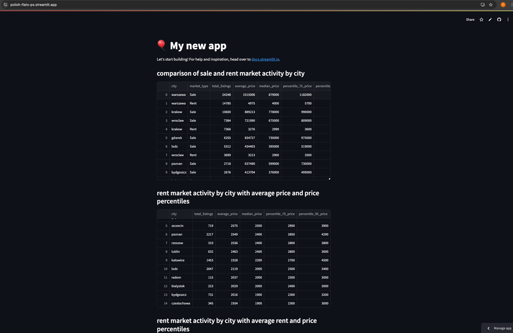
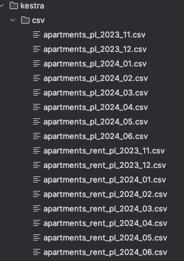

## Overview
This project explores Poland's real estate market, focusing on rental and sales data across cities. The goal is to identify trends, such as price changes and market activity, using an interactive Streamlit dashboard for analysis and visualization.  
Tools & Technologies

## Accessible via
https://polish-flats-ps.streamlit.app/

### 1. Docker Compose & PostgreSQL
   Purpose: Set up a local database to store and manage real estate data.
   Command:
   docker-compose -p kestra-postgres up -d
### 2. DBT (Data Build Tool)
   Purpose: Transform raw data into structured formats for analysis.
   Command:
   pip install dbt-bigquery
### 3. Kestra
   Used to merge and aggregate 16 csv files from folder kestra/csv from [dataset](https://www.kaggle.com/datasets/krzysztofjamroz/apartment-prices-in-poland):

   Purpose: Automate data pipelines for extracting, transforming, and loading (ETL) data into PostgreSQL and BigQuery.
### 4. BigQuery
   Purpose: Process large datasets and perform advanced queries, such as median and percentile calculations.
### 5. Cloud DBT
   Purpose: Build and test data transformation pipelines in the cloud for real-time analytics.
### 6. Streamlit
   Purpose: Create an interactive dashboard for visualizing data.
### 7. Pandas
   Purpose: Manipulate and clean CSV data for analysis.
   Features
   Market Activity by City: View rental and sale prices, including percentiles and averages.
   Rent vs. Sale Comparison: Analyze how rental and purchase prices differ across cities.
   Market Dynamics: Track price changes over time.

###   How to Run Locally
   Clone the repository:
   git clone https://github.com/elgrassa/Data-engineering-professional-certificate.git
   cd Data-engineering-professional-certificate
   Start PostgreSQL and Kestra:
   docker-compose -p kestra-postgres up -d
   Install dependencies:
   pip install -r requirements.txt
   pip install dbt-bigquery
   Run the Streamlit app:
   streamlit run streamlit_app.py
   Open the app at http://localhost:8501.

### Data Sources

###    Future Improvements
   Add dynamic filters for cities and price ranges.
   Implement time-series forecasting for price trends.
   Add charts/graphs for wife, requested to replace some tables 
###    Conclusion
This dashboard simplifies the analysis of Poland's rental dynamic market, but needs UI improvements