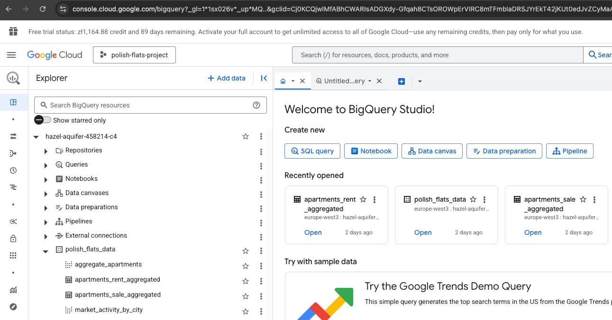
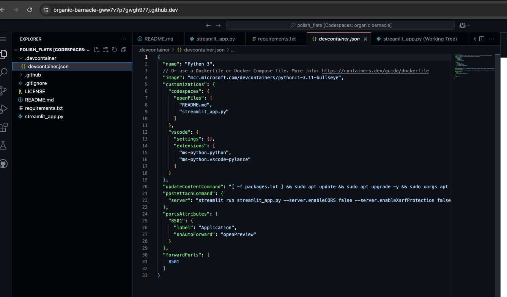

## Overview
This project explores trends in Poland’s real estate market, with a particular focus on both rental and sales data across
several cities. The goal is to identify market behaviors—such as price fluctuations and activity levels—through an 
interactive dashboard built with Streamlit:
- Identify price fluctuations and percentiles across time and location.
- Compare rent vs. sales activity.
- Make informed property decisions using a visual dashboard.

**Note:** Some smaller cities, including Bydgoszcz, Gdynia, and Szczecin, have less active real estate markets.
As a result, the data coverage there may be more limited, and visualizations may not be as detailed.

## Access the Dashboard
You can try out the app here:
👉 https://polish-flats-ps.streamlit.app/ 


**Tools & Technologies Used**
### 1. Docker Compose & PostgreSQL
Set up a local PostgreSQL database to manage and store the raw and transformed real estate data.
from 'kestra' folder execute:
**Command**:
   ```bash
   docker-compose -p kestra-postgres up -d
   ```

### ☁️ 2. Cloud Infrastructure

This project uses several cloud tools:

Google BigQuery: Hosts the transformed datasets for analysis.
DBT Cloud: Performs modular transformations and testing on the datasets.
Streamlit Cloud: Hosts the frontend dashboard for public access:
👉 https://polish-flats-ps.streamlit.app/


### 3. Data Ingestions - Kestra
which contain rental and sale listings sourced from the [dataset](https://www.kaggle.com/datasets/krzysztofjamroz/apartment-prices-in-poland):
Kestra is used to orchestrate ingestion from 16 monthly CSVs located in kestra/csv/.
These are batch-ingested into PostgreSQL and BigQuery, using two Kestra flow YAMLs:
build-dbt.yaml
polish_flats_unified_loader.yaml
Execution is parameterized by year and month.
The pipeline includes:
Extraction from CSVs
Loading to PostgreSQL/BigQuery
Triggering DBT transformations


**Note:** The automated scheduling is currently disabled, as the dataset isn't updated regularly.

### 3.1 Data Ingestion – Stream

This project does **not** use real-time streaming tools (like Kafka or Spark Streaming).  
Focus is on historical batch processing from monthly Kaggle datasets, as there is no realtime stats by flats purchase/rents

### 4. Data Warehouse - BigQuery
Used to run advanced SQL queries for gaining insight into price distributions and trends across different cities.
Data is stored and queried in Google BigQuery
Transformed tables include:
City-level rental and sales medians
Monthly market activity aggregates
Partitioning and clustering are not yet applied, but DBT models are structured and reusable for future optimization.
Bigquery usage evidence


### 5. Cloud DBT
DBT Cloud was used to clean, test, and structure the transformed data. After CSV files were 
ingested into BigQuery, DBT Cloud executed modular SQL models to create curated tables with calculated 
fields such as medians, percentiles, and trends. This helped ensure consistency and reusability 
across all data transformations.
DBT Cloud is used to clean and model the ingested data.
SQL models are located in the /models/staging/polish_flats directory.
Example models:
rent_price_dynamic_by_city.sql
sale_market_activity_by_city_with_price_percentiles.sql

**Issue & Workaround:**
During testing, Streamlit occasionally failed due to sync delays from the US cluster of DBT Cloud.
To avoid instability and manual restarts, I switched to using pre-exported CSVs for local analysis.
This significantly improved performance and reliability.

### 6. Streamlit
Serves as the frontend for the project, presenting the analyzed data through an intuitive and interactive dashboard.
Developed in Github codespaces:

**Features:**
Interactive charts: Compare city-level rental and sales trends.
Real-time filtering: Narrow down data by city, price range, or transaction type.
Flexible views: Switch between bar, line, and time-series charts to explore the market from different perspectives.
Instant updates: Dashboard content refreshes as filters are adjusted.
Decision support: Helps users better understand pricing trends for apartments across Poland.

### 7. Pandas
Used throughout the project for data cleaning and manipulation of CSV files.
Highlights:
City-by-city price analysis (mean, median, percentiles)
Rental vs. sales price comparisons
Time-based trend monitoring

## Dashboard
Visit the live app at 👉 https://polish-flats-ps.streamlit.app
Key Features:

📈 4+ interactive charts showing rental and sales activity by city
🔍 Real-time filtering by city, price range, and transaction type
🔄 View switching: bar, line, and time-series visualizations
📁 CSV-based input for both local and cloud deployments
📌 Column pinning and sorting for detailed table inspection
The dashboard supports data-driven decision-making for apartment prices across Poland

### How to Run Locally
Set it up on your own machine/cloud services by:
cloning the repo

```bash
git clone https://github.com/elgrassa/Data-engineering-professional-certificate.git
cd Data-engineering-professional-certificate
```

Next, you'll need to start PostgreSQL and Kestra using Docker:

```bash
docker-compose -p kestra-postgres up -d
```

After that, make sure to install the required dependencies:

```bash
pip install -r requirements.txt
pip install dbt-bigquery
```
Execute kestra flows for each csv from kestra/csv using month and year as inputs.
**Important:** Don't forget to update your `.bashrc` and export the necessary variables as indicated in the execution 
warnings. Some steps, particularly for bash configurations, might not be fully documented.

### Create a DBT Cloud Project
DBT Cloud is used in this project to transform raw real estate data (from CSVs loaded into BigQuery) into a clean, analysis-ready format. It lets you write modular SQL models, test data integrity, and build repeatable pipelines without managing infrastructure.
To get started:
Go to DBT Cloud and sign in (or register if you're new).
Click "New Project" or "Create a Project" in the dashboard.
Follow the wizard:
Name your project.
Choose whether to connect to a Git repo or skip that step for now.
Select Google BigQuery as your warehouse (this connects DBT to your raw data in BigQuery).

### Add Connection to BigQuery
Once the project is created:
In your DBT Cloud project, navigate to the “Settings” tab, then choose “Connections”.
Click “New Connection” and pick Google BigQuery from the list.
DBT Cloud will ask for a service account key file. You’ll need to:
Go to Google Cloud Console.
## Select or create a new service account.
Open IAM & Admin > Service Accounts.
✅ Tip: Make sure your service account has at least the following permissions,
I really had a lot of issues trying to change it later:
BigQuery Data Editor
BigQuery Job User
BigQuery User

## Generate a JSON key and download it to your machine.
⚠️ Don't commit this file — add it to .gitignore.
Upload this file into DBT Cloud.
After authentication:
Enter your BigQuery project ID.
Specify the dataset where DBT will create or access tables.
Choose the correct location/region for your dataset (e.g., europe-west1).

## Specify the Project and Dataset:
Configure:
Project ID: your BigQuery project.
Dataset: the dataset DBT will read from and write to.
Location: the region of your BigQuery dataset (e.g., europe-west1).
Once saved, DBT will test the connection. If successful, you're ready to run models and transform your data.

## Export Transformed Data from BigQuery
After your DBT models are built and run (via the Cloud UI or CLI):
Open the BigQuery Console.
Go to the dataset used by DBT (defined in your project settings).
Select the output tables you want to visualize (e.g., monthly median prices or city-level aggregates).
Click Export and choose:
Export to Google Cloud Storage, or
Download as CSV (recommended for quick local use)

💡 Tip: For local Streamlit use, downloading the tables as CSV is typically the easiest option.

## Load Transformed Data into Streamlit
Once your cleaned CSVs are exported:
Clone or update the Streamlit app repo:
👉 https://github.com/elgrassa/polish_flats

Replace existing CSVs or add the new ones in the expected data folder.
In streamlit_app.py, double-check:
File paths match the new filenames
Any filters or selectors work with the new structure
launch the app with 
```bash
   streamlit run streamlit_app.py
```

Visit the app in your browser at:  http://localhost:8501.

### Data Sources
All real estate data used in this project comes from Kaggle: [Kaggle](https://www.kaggle.com/datasets/krzysztofjamroz/apartment-prices-in-poland),


**Note:**
🏙️ Some smaller markets—like Bydgoszcz, Gdynia, and Szczecin—may show incomplete visualizations due to limited data availability.

### Future Improvements
Here are a few improvements planned for future iterations:
 - Add more advanced filtering options (e.g., by city or price range)
 - Include time-series forecasts to help predict future price movements
 - Replace static tables with dynamic, visual charts

### Final Thoughts
This project provides a clear and interactive view of rental and sales activity across Poland’s real estate market.
While the current dashboard is functional and informative, future updates aim to improve usability,
forecasting, and interactivity to make the insights even more accessible.
